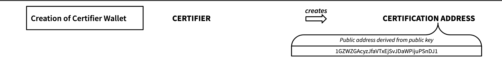

# Whitepaper: Open Content Certification Protocol (OCCP)

# Status of this document
[[^toc]](#toc)

This draft version is open for feedback and discussion. It can be shared according to the license.

Date: 2020-09-08\
Version: 0.3

# License
[[^toc]](#toc)

This work is licensed under CC BY-NC-ND 4.0.

Summary:
[https://creativecommons.org/licenses/by-nc-nd/4.0](https://creativecommons.org/licenses/by-nc-nd/4.0)\
License:
[https://creativecommons.org/licenses/by-nc-nd/4.0/legalcode](https://creativecommons.org/licenses/by-nc-nd/4.0/legalcode)

# Contributors
[[^toc]](#toc)

## Author

Sebastian Posth\
[Posth Werk BV](https://posth.me/)

Twitter: [\@posth](https://twitter.com/posth)\
LinkedIn:
[https://www.linkedin.com/in/posth/](https://www.linkedin.com/in/posth/)

Sebastian Posth is an entrepreneur and consultant in the media
industries with a focus on digital innovation and decentralized ledger
technology.

Sebastian is Director of the ISCC Foundation, an independent
international nonprofit organization that promotes the development and
adoption of the International Standard Content Code.

## Co-Author

Kevin Wittek\
[wittek.dev](https://wittek.dev/)

Twitter: [\@kiview](https://twitter.com/kiview)\
LinkedIn:
[https://www.linkedin.com/in/kevin-wittek/](https://www.linkedin.com/in/kevin-wittek/)

Kevin Wittek is Head of the Blockchain Lab at the Institute for Internet
Security, Westphalian University of Applied Sciences, member of the
Sovrin Steward Council (Digital Identity and SSI) and bloxberg
consortium (Trusted Research).

After many years working in the industry as a software engineer, Kevin
is now doing his PhD in computer science in the field of distributed
systems engineering and is an active member of the Open Source Software
community.

# OCCP -- Overview
[[^toc]](#toc)

\
*Fig.: OCCP – Overview*

Table of Content 
================

**[Status of this document](#status-of-this-document)**

**[License](#license)**

**[Contributors](#contributors)**

> [Author](#author)
>
> [Co-Author](#co-author)

**[Table of Content](#table-of-content)*

**[Terms and Definitions](#terms-and-definitions)**

**[Abstract](#abstract)**

**[Motivation](#motivation)**

> [Disinformation and Fake News](#disinformation-and-fake-news)
>
> [Missing Identifiers and Attribution](#missing-identifiers-and-attribution)
>
> [Missing Rights Information](#missing-rights-information) 
>
> [EU Directive 2019/790](#eu-directive-2019790)
>
> [Digital Commerce](#digital-commerce)

**[Approach](#approach)**

**[Stakeholders](#stakeholders)**

**[International Standard Content Code
(ISCC)](#international-standard-content-code-iscc)**

**[Content Certification](#content-certification)**

> [Public Key Cryptography](#public-key-cryptography)
>
> [Decentralised Cross-Chain
> Registry](#decentralised-cross-chain-registry)
>
> [Self-Authorisation of the
> Registrant](#self-authorisation-of-the-registrant)
>
> [Certification Transaction](#certification-transaction)
>
> [Registrant Pseudonymity](#registrant-pseudonymity)
>
> [Future Transactions](#future-transactions)

**[OCCP -- Overview](#occp-overview)**

**[Use Cases](#use-cases)**

**[Set-up](#set-up)**

> [Creation of Certifier Wallet](#creation-of-certifier-wallet)
>
> [Public Self-Authentication ofCertifier](#public-self-authentication-of-certifier)
>
> [Creation of Registrant Wallet](#creation-of-registrant-wallet)
>
> [Registrant Identity Verification](#registrant-identity-verification)
>
> [Challenge](#challenge)

**[Verification of Content
Certificates](#verification-of-content-certificates)**

**[OCCP -- Process Overview](#occp-process-overview)**

**[Further Discussion](#further-discussion)**

> [Decentralised Identifiers (DIDs)](#decentralised-identifiers-dids)
>
> [Verifiable Credentials](#verifiable-credentials)
>
> [Governance](#governance)

**[User Applications](#user-applications)**

**[Design Goals](#design-goals)**

**[References](#references)**

**[FAQ](#faq)**

# Terms and Definitions
[[^toc]](#toc)

**Actor**\
individual or organisation, program or machine that performs an action

**Entity**\
legal individual or organisation

**User**\
individual or organisation that interacts with a software application,
an online service or a platform

**Consumer**\
individual that consumes digital media content

**Registration**\
the act of registering an ISCC on a public blockchain network, which
might represent or be connected to an assertion or claim of an
individual or organisation

**Assertion**\
declaration of a positive statement without evidence or proof

**Claim**\
assertion of ownership or entitlement

**Registrant**\
individual or organisation that registers an ISCC, assertions or claims
on a public blockchain network

**Registration address**\
blockchain address that is generated and used by the registrant

**Rightsholder**\
individual or organisation that holds rights to a specific digital media
asset;

**Validation**\
the act of validating an assertion or a claim

**Verification**\
the act of verifying and confirming an assertion or a claim

**Falsification**\
the act of falsifying and disproving an assertion or a claim

**Attestation**\
the act of attesting; public acknowledgment, confirmation or affirmation of an assertion or a claim

**Identity**\
defined by characteristics or properties describing an individual or
organisation

**Identification**\
formal acknowledgment of the identity of an individual or organisation

**Authenticity**\
quality of being genuine and not manipulated

**Authentication**\
act of proving an assertion in order to verify identity

**Attribution**\
formal acknowledgment of a certifier that a registrant of an ISCC is a rightsholder or
has another defined relationship to the digital asset

**Certification address**\
blockchain address that is generated and used by the certifier

**Certifier**\
publicly known, legally established and registered organisations (e.g.
in the local chamber of commerce) or other entities that are entitled to
perform acts of certification

**Content certification**\
act of attestation by a certifier; public acknowledgment by the
certifier that a specific assertion or claim can be associated with an
entity whose identity has been verified by the certifier

**Content Certificate**\
result of certification process, issued automatically when a certification
transaction is confirmed on a public blockchain network

**Digital Media Asset**\
file encoded in a specific format

**Content**\
Substance of what is contained

**Content identification**\
Generating an ISCC for the purpose of identification and verification of
the identity of content

# Abstract
[[^toc]](#toc)

\
*Fig.: Example of a content certificate, image via pixabay.com*

The Open Content Certification Protocol (OCCP) provides a description of
the process and involved technologies that can be used by creative
individuals, media organisations or consumers to generate or verify
certificates for digital media content.

Content certificates allow rightsholders to inseparably and verifiably
connect information, basic metadata, licensing terms and other rights
management information to digital content.

Public organisations can act as certification authorities. By means of
a blockchain transaction certifiers openly testify that they have
verified the identity of an entity and acknowledge that a specific
assertion or claim to a digital asset can verifiably be associated with
this entity.

It is the goal of the certification process to create trust in
assertions, claims and the authenticity of the original content, and to
ensure accountability of entities, even if they must or prefer to remain
pseudonymous.

Content Certificates are the result of the certification process. They
are issued automatically when a certification transaction is confirmed on
any public blockchain network. Thus, content certificates are open,
discoverable and verifiable by anyone online and accessible for
individuals or systems, using software applications or APIs.

Services and applications can process content certificates in an
automated way so that their users can verify the authenticity of digital
media content, the identities of certifiers and registrants, and their
assertions or claims to the content by having access to the digital
assets, only.

# Motivation 
[[^toc]](#toc)

What has been our motivation to publish the whitepaper for the Open 
Content Certification Protocol? What we are seeing at this moment 
is the convergence of a number of independent developments that 
need to be addressed in order to shape the future of digital media publishing
for the benefit of the cultural and creative communities. 

## Disinformation and Fake News

Digital media content is ubiquitous, online. Songs, videos, texts and
images are published and shared on websites, blogs or on social media,
an ever increasing proportion of news and media consumption is moving
online.

In this area of abundance of content, (intentional) misinformation and
(unintentional) disinformation is becoming a problem for societies. How
can consumers and online platforms evaluate content integrity and learn
what information to trust or not? It requires effort, knowledge and
skills to verify the authenticity of original publications. And it
requires simple and reliable methods and tools to check whether they
have been manipulated or not.

Policy makers in all parts of the world are trying to tackle the current
media crisis and fight misinformation and fake news by enforcing an
increased transparency and greater accountability for content that is
published online by users and rightsholders. [1](#f1)

## Missing Identifiers and Attribution

Proper content identification and attribution are fundamental
prerequisites to tackle fake news and misinformation.

But how can consumers validate content when identifiers and basic
metadata are often missing? Although some media industries use standard
identifiers (such as ISBN, DOI, ISRC etc.), most of the existing content
online does not have an open, standardised and reproducible identifier.
Without digital content-derived identifiers, it is a time- consuming and
difficult endeavour for consumers to unambiguously identify digital
content and understand, who originally created and published it. Also,
we can also observe a political agenda from the European policy makers
for more transparency and accountability.

## Missing Rights Information

Creators demand respect, attribution and fair remuneration for their
creative work. But without basic metadata, licensing terms and other
rights management information, inseparably connected to the content, it
is exceedly difficult to properly credit a work or learn about the terms
of use.[2](#f2)

Content creators and other rightsholders lack an easy way to provide
such information. It often results in the misuse or abuse, when content
is published in an inappropriate manner without attribution or available
licensing terms.

Networked peer-to-peer transactions in the Web3.0 environment create a
need for efficiency and automation of content licensing.

## EU Directive 2019/790

The new [European Directive 2019/790 on Copyright in the Digital Single
Market](https://eur-lex.europa.eu/eli/dir/2019/790/oj), which has
to be implemented by the national parliaments by June 2021, will
introduce new regulations to the content markets. E.g. article 17
requires online content-sharing service providers (OCSSP) to clear the
rights of content that has been published on their platforms or uploaded
by the users of their services. It is almost impossible that the
requirements of the Directive can be implemented in national laws
without smart technology for automated content identification and automated
retrieval of basic and verifiable metadata and rights management
information.

The Directive includes a clear recommendation for rightsholders to
"provide the service providers with relevant and necessary information".
This means that in order to benefit from the Directive and avoid
misappropriation of content online, rightsholders need to verifiably
publish reliable, accurate and comprehensive metadata in a timely
manner, and make rights management information openly available and
easily accessible for automated retrieval.[3](#f3) 
For rightsholders we
conclude a legal necessity to act.

## Digital Commerce 

Despite the fact that the internet itself is decentralised in its
technical nature, only a limited number of popular applications benefit
from the content generated by creative individuals and other users. It
is the same with professional digital media content online -- only a few
centralised retailers and platforms control the terms, supply and
demand, access to content, user accounts, data and communication.

Business models of media organisations are at stake due to this
concentration of power and data by large intermediaries, retailers and
platforms and the inefficiency of the markets which results from this
situation.

Lack of trust creates oligopolies. Only when trust in content
authenticity, attribution and licensing information will no longer be
exclusively guaranteed by large and centralised organisations,
competition will be re-introduced to the media markets. Existing
technology, open-source software as well as the suggested open,
transparent standards for content identification and content
certification can support this development. We observe a requirement for
innovation in the digital media marketplaces.

## Approach
[[^toc]](#toc)

The Open Content Certification Protocol (OCCP) suggests a process to
create and verify content certificates by using open, content-derived,
decentralised content identifier technology on public blockchain
networks. It is based on two layers:

1\) the [International Standard Content Code
(ISCC)](https://iscc.codes/), maintained by the [ISCC
Foundation](https://iscc.foundation/),

2\) the [decentralised cross-chain registry
protocol](https://github.com/titusz/iscc-registry), developed by
Titusz Pan.

\
*Fig.: layer model*

The specification of the ISCC provides a way to generate unique
identifiers for digital media content. The decentralised cross-chain
registry protocol creates a ledger of transactions that associate
identifiers with pseudonymous registrants of ISCCs, assertions or
claims. The OCCP suggests a way to connect a pseudonymous registrant
with verifiably identifiable entities.

Just like websites use SSL certificates (allowing the use of secure
HTTPS connections) to create trust, security and provide relevant and
reliable information to users online, trustable and verifiable content
certificates can act as a building block to create trust in online
publications, data and information, reduce illegitimate misappropriation
of content, support a fair remuneration for creative individuals and
media organisations, and reintroduce competition in the current media
landscape.

## Stakeholders
[[^toc]](#toc)

Content certification will benefit content creators, media organisations
and **all rightsholders in the value chain** of the cultural and
creative industries who want to publish certified content and verifiably
attach trustworthy information: basic metadata, copyright ownership
information, licensing terms, rights management information and other
assertions or claims to digital media content.

**Platforms** (or online content-sharing service providers (OCSSP),
according to the [Directive
2019/790](https://eur-lex.europa.eu/eli/dir/2019/790/oj) will be
able to identify digital content, verify the authenticity of the
original content, receive ownership information, get access to
trustworthy basic metadata, copyright ownership, licensing terms, rights
management information and other assertions or claims for certified
digital media content, and potentially clear the rights of media assets
and user generated content in an automated way.

**Consumers** will be empowered to conveniently identify original
content and reliably verify its authenticity, to identify the entities
associated with specific assertions or claims, or to express and utilise
digital content ownership.

# International Standard Content Code (ISCC) 
[[^toc]](#toc)

With the emergence of web 3.0 the Internet is moving towards a network
of automated peer-to-peer transactions. An increasing amount of dynamic,
short-lived and granular content needs to be managed by a variety of
entities with different interests and requirements. Digital content
continuously re-encodes, resizes, and re-compresses, changing its
underlying data as it travels through a complex network of actors and
systems.

Identifiers are randomly and ambiguously applied to content files.
Metadata or licensing terms are often incoherently and loosely attached
to the content, distributed in separate files, or subject to individual
legal negotiations -- all of this is time-consuming and prone to errors
and manual interventions. Distributing and licensing digital content on
a global scale is often an all too complicated and inefficient process.

This situation requires new and innovative approaches, technologies and
tools. Freely accessible standard identifiers, that are specifically
designed to manage digital content, are a fundamental prerequisite for
efficient transactions in a decentralised and increasingly heterogeneous
media environment.

The International Standard Content Code (ISCC) is a new identifier for
digital content. It helps creative individuals and media organisations
to better manage their assets by using machine learning, fingerprinting
and cryptographic technologies. The ISCC can be used to identify digital
assets of all media-types like text, image, audio and video in all
granularities across all industry sectors alongside existing standard
identifiers.

The ISCC supports versioning, deduplication, content clustering,
timestamping, similarity detection and granular identifier assignment.
It enables content transactions to operate faster and more efficiently
in networked and increasingly decentralised media environments.

The ISCC is an **identifier that is created from the content file
itself**. This means that an ISCC can be generated by anyone with
access to the content, free of charge by using open-source software. By
using ISCC, anyone with access to digital content -- it could be the
original creator, a publisher, an intermediary, an online platform
(OCSSP) or a consumer -- can decentrally generate the same identifier
from the same digital asset. This allows anyone to unambiguously
identify same or similar content independently of centralised
organisations, registries or proprietary third-party services and
software.

\
*Fig.: Step from OCCP – Process*

Processing the content with the algorithms defined by the [ISCC
specification](https://iscc.codes)[4](#f4) creates a unique composite
code, that consists of four major elements: the Meta-Code, Content-Code,
Data-Code, and Instance-Code. Thus, the ISCC identifies and describes
content across multiple layers: From the embedded or external metadata,
the normalised content, the encoded file data down to the bitstream of
an individual file. It can be used to automatically distinguish
different versions of the same content, to ensure data integrity by
recognising data manipulation, to de-duplicate, or to disambiguate
content in a given content repository.

The ISCC will be even more useful the more users agree on the suggested
standard procedure of generating the ISCC. In 2019, the International
Organisation for Standardisation ISO decided to accept the International
Standard Content Code (ISCC) as a Preliminary Work Item (PWI) and to
establish a working group [ISO TC 46/SC 9/WG
18](https://www.iso.org/committee/48836.html) called 'NP 24138
International Standard Content Code' to investigate the proposal.[5](#f5)

# Content Certification
[[^toc]](#toc)

## Public Key Cryptography

Due to the fact that anyone can generate ISCCs from digital assets,
anyone can at the same time publish the content codes on the internet or
on blockchains for various reasons. Creative individuals, media
organisations or other rightsholders may register ISCCs in order to
publish assertions, connect metadata, rights management information or
other claims to the identifier. Other registrants may want to express
ownership of a license or simply prove that they had access to a
specific document or file by generating and publishing an ISCC.

It is important to highlight that assertions or claims to the content
can be made -- in principle -- by anyone regardless of rights or content
ownership and without consent of the actual rightsholders. These claims
may be justified, but they are not -- per se -- transparently verifiable
for third parties.[6](#f6)

However, when an ISCC is registered on a public blockchain, this happens
in the context of a transaction which is public, open and transparent.
Public blockchain networks are based on public key cryptography. This
means that transactions on these blockchains usually allow to infer the
pseudonymous actor who triggered a transaction by means of his
pseudonymous public address. This public address is derived from the
public key of the actor. In order to perform a blockchain transaction,
the actor needs to be in control of the corresponding private key; this
allows him to cryptographically sign the blockchain transaction. The
fact that there is always a pseudonymous actor that performs the
transaction implies that there is always a potentially identifiable
actor. This is the conceptual foundation for the OCCP.

## Decentralised Cross-Chain Registry 

The specification for the ISCC provides a way to generate unique
identifiers for digital media assets that can be registered by any actor
on public blockchain networks. The decentralised cross-chain registry
protocol[7](#f7) describes a way to generate a ledger of registrations from
transactions across multiple blockchain networks. This suggested second
layer protocol for the ISCC will create a global and publicly auditable
ledger of blockchain transactions that associate ISCCs with pseudonymous
registrants of ISCCs, assertions or claims.

According to the proposal for a decentralized cross-chain registry
protocol for ISCCs, each individual registration of an ISCC on a public
blockchain network will generate a short and unique registration
identifier, the ISCC-ID. When analysing the registration process, the
ISCC-ID will link back to the registration transaction that will resolve
into the ISCC and the registration address. Thus, the ISCC-ID is 'owned'
by the registrant in such a way that it can be verified that the
registration transaction for a specific ISCC has been cryptographically
signed by the private key of the registrant. This inseparably binds a
specific ISCC to the pseudonymous actor of a blockchain transaction.

\
*Fig.: Overview of ISCC -- Decentralized Cross-Chain Registry Protocol, by Titusz Pan via [Github](https://github.com/titusz/iscc-registry/blob/master/README.md), (accessed Sept. 08, 2020)*

## Self-Authorisation of the Registrant

The pseudonymous actor of a blockchain transaction could now trigger a
process of self-authentication to reveal his identity -- to a certain
degree -- and provide information that proves in a transparent,
verifiable and automated way to the public that he is in control of the
private key that generated the registration address.

One possible and suggested way for registrants to authenticate
themselves is through a process of domain validation. This method
assumes that the registrant controls a public website that discloses
personal identifiable information (PII), and that only the registrant is
in control of the web-hosting resource and domain that is used for the
website.

The registration address could be published on the website of the
registrant in such a way that it is suitable for human interpretation as
well as supporting automated, machine-readable verification by
applications. In a second step, the registrant needs to
cryptographically sign a public blockchain transaction that includes the
domain that contains the public registration address on the website of
the registrant. The fact that the public key that generated the
registration address is generated from the same private key that signed
the blockchain transaction that included the domain is proof that the
registrant has control over the certification address.

This self-authorisation connects the registrant of an ISCC to personal
identifiable information (PII) -- which can by itself be considered as a
claim. But the data could be wrong, outdated or provided on any website
by a malicious actor. Self-authorisation without a verification by a
third party does not address concerns that any actor can generate an
ISCC from a digital asset, any actor can register an ISCC on a public
blockchain network, and any actor can associate assertions or claims
with the ISCC. This is where content certification comes into play.

## Certification Transaction

In a most basic definition, content certification is an act of
attestation by third parties. These need to be publicly known, legally
established and registered organisations or other entities that are
entitled to perform acts of certification. By signing a blockchain
transaction that contains the ISCC-ID, a certifier openly testifies that
he has verified the identity of a registrant of an ISCC at this point in
time. Moreover, the certifier attests that a specific registration,
assertion or claim to a digital asset can verifiably be associated with
an entity whose identity has been verified by the certifier.

It is important to note that with a certification transaction **the
certifier does not legally acknowledge attribution**. Although it
could be the case that the registrant is in fact the original creator or
a licensor in the value chain, who owns specific rights to use oder
distribute content, or it could be the case that an individual or
organisation is in fact otherwise entitled to provide authoritative
metadata, licensing terms, rights management information to the content;
**the certifier cannot make any legally binding statement about the
registrant\'s specific relationship with the content**.

Above, content certificates do not designate any specific details of the
rights of an entity to the content. Content certificates only designate
that the registrant of an ISCC, a specific assertion or claim is known
to the certifier, which the certifier can declare due to the bilateral
agreement concluded by the registrant and the certifier.

## Registrant Pseudonymity

It is the goal of the content certification to create trust in
assertions, claims and the authenticity of the original content, and to
ensure accountability of registrants, even if they must or prefer to
remain pseudonymous. While, according to the OCCP, a certifier is
required to be publicly known and identifiable, a registrant of an ISCC
may have a vital or legitimate interest in remaining pseudonymous and
undisclosed to the general public.

In order to allow for even higher degrees of pseudonymity, the
registrant can use the concept of Hierarchical Deterministic
Wallets[8](#f8), to create a new public key for each registration
transaction. This prohibits outside observers to correlate multiple
transactions, which could be misused as a heuristic to identify the
registrant. The registrant only needs to share his public extended key
with the certifier, which allows the certifier to correlate all derived
public keys with the corresponding identity.

The certification of the ISCC-ID is a public acknowledgment by the
certifier that a specific assertion or claim to a digital asset can be
associated with an entity whose identity has been verified by the
certifier. In case of a legal dispute and if requested by court, the
certifier might be obliged to reveal the identity of a registrant to
proceed in trial and settle the case. Legal regulation for dispute
resolution is subject to specific local legislation and out of scope of
the OCCP.

Note that a potential database containing the relationship between
public keys and identities operated by the certifier for means of
de-pseudonymization, is also an attack vector for cyber threat actors
wishing to maliciously de-pseudonymize registrant addresses. Mitigations
and protective countermeasures for this attack vector are out of scope
of the OCCP.

## Future Transactions

Content certification will create trust in the individual or
organisation that registered an ISCC and provided metadata, licensing
terms and rights management information or other assertions and claims
which might be associated with a specific ISCC.

The certification of the ISCC-ID by the certifier also entails that a
registrant will permanently 'own' this ISCC-ID in the sense that the
ISCC-ID will remain connected to the registrant. In the future,
metadata, licensing terms, rights management information or other
assertions and claims may be connected to the ISCC-ID without the need
to be certified again. With his public/private key pair the registrant
can technically prove that any follow-up messages or data entries
associated with the ISCC-ID are generated from the same credentials. For
each subsequent transaction any third party can verify whether new
information has been published by the same credentials as the ones that
are associated with the ISCC-ID.
 

# Use Cases
[[^toc]](#toc)

*1. Membership organisations, collective management organisations (CMO)
or performance rights organisations (PRO) are representing creative
individuals and media organisations in different industry sectors that
own rights to content or performances. The organisations are acting on
their behalf by selling and distributing content, by collecting
royalties or by representing them in regulatory decision making. CMO's,
PRO's not only know their clients through the membership application. In
many cases they are associated with the rightsholders through a
long-standing collaboration and familiar with the specific works they
might represent on their behalf. Membership organisations, CMO's, PRO's
are ideally suited to act as certifiers for the registrants they
represent.*

*2. A publisher might want to license digital content to a retailer.
According to the licensing agreement, both parties hold rights to the
content: the publisher acquired rights from the creators, the retailer
acquired rights from the publisher. After the conclusion of the
contract, the retailer has a stake in the content and may legitimately
publish a claim, e.g. that he is entitled to sublicense content from the
publisher's digital assortment to his customers. Both, the retailer and
the publisher might have an interest to certify the retailer and his
claims to the content to create trust in the retail platform and
offerings. In this case the publisher could act as a certifier for the
retailer.*

*3. A human rights activist in an authoritarian state captures a human
rights violation by government authorities on video and anonymously
publishes the scene on social media. Because he fears repression the
activist does not want to associate his real name or other personal
identifiable information with the video. On the other hand, the activist
wants to make sure that the video will be recognised as uncompromised
and the authenticity of the recording can be verified by anyone. By
using ISCC and content certification, the activist can pseudonymously
publish the video and inseparably connect basic metadata or copyright
and licensing information to the video, without revealing his real
identity. A human rights organisation can act on behalf of the
registrant as certifier for the content and testify the authenticity of
the content and legitimacy to the connected information.*

# Set-up
[[^toc]](#toc)

In order to start the certification process according to the OCCP, the
registrants and the certifiers need to set-up their wallets as well as
their relationships by concluding bilateral agreements.

## Creation of Certifier Wallet

\
*Fig.: Step from OCCP – Process*

Certifiers can create a certification address for themselves and
independently of any organisation, registry or other centralised
authority. The certification address is a public blockchain address that
is generated from the public key of the certifier. Any blockchain
wallet, that can create a private/public key pair for a blockchain
network, can generate a certification address.

## Public Self-Authentication of Certifier

While the registration address may remain pseudonymous, the OCCP
requires that the identity of the organisation or entity that is in
control of the certification address is publicly revealed. This means
that the certifier needs to prove in a transparent, verifiable and
automated way to the public that they are in control of the private key
that generated the certification address.

One possible and suggested way for certifiers to authenticate themself
is through a process of domain validation. This method assumes that the
certifier controls a public website which discloses verifiable
information about the legal entity[9](#f9), and that only the certifier is
in control of the web-hosting resource and domain that is used for the
website.

\
*Fig.: Step from OCCP – Process*

After creation of the certification address this public address needs to
be published on the websites of the certifier in such a way that is
suitable for human interpretation while also supporting automated,
machine-readable verification by applications.

In a second step, the certifier needs to cryptographically sign a public
blockchain transaction that includes the domain that holds the public
certification address on the website of the certifier. The fact that the
public key that generated the certification address is generated from
the same private key that signed the blockchain transaction that
included the domain is proof that the certifier has control over the
certification address.

Public key cryptography and the transparency and immutability of public
blockchain networks create the trust in this self-authentication of the
certifier.

## Creation of Registrant Wallet

\
*Fig.: Step from OCCP – Process*

Registrants can create a registration address for themselves and
independently of any organisation, registry or other centralised
authority. The registration address is a public blockchain address that
is generated from the public key of the registrant. Any blockchain
wallet, that can create a private/public key pair on a blockchain
network, that will be used to register ISCC, can generate a registration
address.

## Registrant Identity Verification

While, according to the OCCP, the certifier is required to be publicly
known and identifiable, the registrant may have a vital and legitimate
interest in remaining pseudonymous and undisclosed to the general
public.

Nonetheless, the OCCP requires that at least the certifier has verified
the identity of the registrant. To establish their relationship, the
registrant and the certifier must conclude a bilateral contractual
agreement that provides contact information, defines the nature of their
relationship, the services, the liabilities of the certifier and the
registrant, and regulates other matters. This agreement must be signed
offline or offchain.

\
*Fig.: Step from OCCP – Process*

## Challenge

After signing the agreement, the registrant needs to provide to the
certifier the public key (or the extended public key) that he intends to
use as a registrant. This must be done in an undisclosed and secure
channel, e.g offline, via an end-to-end encrypted messenger, by telefax
or telephone.

The registration address can be verified by the certifier by means of a
simple challenge-response-transaction, in which a secret message,
encrypted with the registrants public key, is transmitted to the
registrant. By decrypting the secret with his private key and disclosing
the secret to the certifier, the challenge is solved. By means of this
challenge, the certifier can verify that a registration address belongs
to the registrant. This challenge needs to be executed in a channel that
is secured from man-in-the-middle-attacks, such as end-to-end encrypted
messengers.

# Verification of Content Certificates
[[^toc]](#toc)

Content certificates are open, discoverable and verifiable by anyone
online and accessible for individuals or systems, using software
applications or APIs.

Services and applications can process content certificates in an
automated way so that their users can verify the authenticity of digital
media content, the identities of certifiers and the relationship between
a pseudonymous registrant and an identified certifier, and their
assertions or claims to the content by having access to the digital
assets, only.

\
*Fig.: Step from OCCP – Process*

To resolve the requested information, verifiers can decentrally generate
an ISCC from a digital asset using dedicated software applications.

Depending on how many registrants registered an ISCC, an implementing
software will associate one or potentially multiple different ISCC-IDs
with the ISCC generated from an implementing verification software. Each
of the ISCC-IDs have been generated by a registration transaction
published by a specific registration address, that included a specific
ISCC.

As mentioned above, an ISCC-ID does not necessarily imply that content
has been certified. It could be that either all ISCC-IDs, some or none
might have been certified by either multiple different certifiers, one
or none.

If an ISCC-ID was certified and the certification transaction has been
confirmed on a public blockchain network --, then a content certificate
will have been implicitly issued for this ISCC-ID.

By having identified certified ISCC-IDs, users will be able to find
trustworthy metadata, licensing terms or other rights management
information which registrants might have attached to the content -- and
use the content according to the terms provided by the registrants. In
case of a number of certified ISCC-IDs, verifiers can choose the
certifiers they trust or the licensing terms that suit their individual
needs.

This way, content certificates not only create trust in the authenticity
and reliability of online content, data and information. They can also
facilitate dispute resolution and significantly improve digital content
licensing for creative individuals, media organisations and other
registrants of digital content.

# OCCP -- Process Overview
[[^toc]](#toc)

\
*Fig.: OCCP – Process*

# Further Discussion
[[^toc]](#toc)

The authors of this whitepaper explicitly acknowledge the work of the
members of the internet community on the following standards:

a\) the W3C working draft for [Decentralized Identifiers (DIDs) v1.0.,
its core architecture, data model, and
representations](https://w3c.github.io/did-core/) in its current
version of the working draft from 24 August 2020,

b\) the W3C recommendation for [Verifiable Credentials, data model 1.0,
on expressing verifiable information on the
web](https://www.w3.org/TR/vc-data-model/), as published on 19
November 2019.

c\) the efforts of the DIF working groups, such as
[DIDComm](https://identity.foundation/working-groups/did-comm.html).

d\) the digital trust concepts and interoperability goals of the Trust
over IP Foundation, as outlined in the [Trust over IP whitepaper
V1](https://trustoverip.org/wp-content/uploads/sites/98/2020/05/toip_introduction_050520.pdf),
as published on 5 May 2020.

## Decentralised Identifiers (DIDs)

For the purpose of content certification it makes sense that registrants
and certifiers use decentralised identifiers (DIDs).

*"The Decentralized Identifiers (DIDs) \[\...\] are a new type of
globally unique identifier designed to enable individuals and
organizations to generate our own identifiers using systems we trust,
and to prove control of those identifiers (authenticate) using
cryptographic proofs (for example, digital signatures,
privacy-preserving biometric protocols, and so on).*

*Because we control the generation and assertion of these identifiers,
each of us can have as many DIDs as wxe need to respect our desired
separation of identities, personas, and contexts (in the everyday sense
of these words). We can scope the use of these identifiers to the most
appropriate contexts. We can interact with other people, institutions or
systems that require us to identify ourselves (or things we control)
while maintaining control over how much personal or private data should
be revealed, and without depending on a central authority to guarantee
the continued existence of the identifier."*[10](#f10)

For the OCCP it seems semantically justified to call the public
blockchain addresses of the registrants and certifiers self-sovereign
and decentralised identifiers. However, it is important to mention that
in the current version of the OCCP, these decentralised identities are
**not yet** DIDs according to the technical definitions in the W3C
draft on Decentralised Identifiers.

## Verifiable Credentials 

After investigating the standard and terminology of the Verifiable
Credentials Data Model 1.0, the applicability of the model for digital
content certification as suggested by the OCCP needs to be further
discussed.[11](#f11)

Content certification could be considered and described as a 'process
that consist of a blockchain transaction performed by an issuer
providing tamper-evident verifiable credentials to a verifier about a
subject (content) and its relation to the holder (registrant) that can
be cryptographically verified'.

On the other hand, there is a need to discuss whether content
certificates as issued according to the suggested OCCP could be issued
to the holder according to the Verifiable Credentials Data Model.
However note, that the OCCP not only describes the process by which
content certificates are issued, but also includes the process of
publishing them in a public registry.

## Governance

It is obvious that the governance model for content certification needs
to be further elaborated. Because of the fact that the OCCP can be
applied and technically implemented by organisations in principle
without permission, it is nonetheless important that the OCCP provides
clear guidelines on the fundamental principles and standards of content
certification.

The governance of content certification needs to be maintained by a
not-for-profit organisation. It will be the goal of this organisation to
serve the global online and content community by maintaining the
protocol and governance that support transparent and auditable content
certification services, which includes offering conceptional advice,
coaching and ethical guidance as well as technical documentations.

# User Applications
[[^toc]](#toc)

User application that support the OCCP:

Licium -- [Licium.app](http://licium.app)

# Design Goals
[[^toc]](#toc)

The OCCP is based on the following design goals:

-   Transparency
-   Trust
-   Security  
-   Openness
-   Fairness
-   Inclusiveness
-   Simplicity
-   Interoperability
-   Discoverability

# References
[[^toc]](#toc)

\[1\]"BIP-0032 - Key derivation," GitHub.
https://github.com/bitcoin/bips (accessed Sep. 02, 2020).

\[2\]"Content Authenticity Initiative," Content Authenticity Initiative.
https://contentauthenticity.org (accessed Sep. 02, 2020).

\[3\]D. Reed, M. Sporny, and M. Sabadello, "Decentralized Identifiers
(DIDs) v1.0." https://w3c.github.io/did-core/ (accessed Sep. 02, 2020).

\[4\]"DEEPTRUST ALLIANCE," DEEPTRUST ALLIANCE.
https://www.deeptrustalliance.org (accessed Sep. 02, 2020).

\[5\]Council of the European Union, "Developing the Copyright
Infrastructure - Stocktaking of work and progress under the Finnish
Presidency." Accessed: Sep. 02, 2020. \[Online\]. Available:
[https://data.consilium.europa.eu/doc/document/
ST-15016-2019-INIT/en/pdf](https://data.consilium.europa.eu/doc/document/ST-15016-2019-INIT/en/pdf).

\[6\]"EUR-Lex - 32019L0790 - EN - EUR-Lex."
https://eur-lex.europa.eu/eli/dir/2019/790/oj (accessed Sep. 02, 2020).

\[7\]"ISCC - Content Identifiers." https://iscc.codes/ (accessed Sep.02, 2020).

\[8\]"ISO/TC 46/SC 9 - Identification and description," ISO.
[https://www.iso.org/cms/render/live/en/sites/isoorg/contents/data/committee/04/88/48836.html](https://www.iso.org/cms/render/live/en/sites/isoorg/contents/data/committee/04/88/48836.html) (accessed Sep. 02, 2020).

\[9\]A. Preukschat and D. Reed, Self-Sovereign Identity. ManningPublications, 2021.

\[10\]T. Pan, titusz/iscc-registry – HackFS – Decentralized Content Identifier Registry. 2020.

\[11\]M. Sporny, G. Noble, D. Longley, D. Burnett, and B. Zundel, "Verifiable Credentials Data Model 1.0."
[https://www.w3.org/TR/vc-data-model/](https://www.w3.org/TR/vc-data-model/) (accessed Sep. 02, 2020).

 
# FAQ
[[^toc]](#toc)
We will list and answer frequently asked questions in this document: [FAQ](faq.md) 

# Footnotes
[[^toc]](#toc)

<a id="f1">FN 1:</a> See also initiatives in the US, like the Deeptrust Alliance
    [www.deeptrustalliance.org](http://www.deeptrustalliance.org)
    or the Content Authenticity Initiative (CAI), led by Adobe, Twitter
    and the New York Times: [https://content
    authenticity.org](https://contentauthenticity.org/). [[^1]](#a1)

<a id="f2">FN 2:</a> Or as the working party on intellectual property (copyright) from
    the Finnish government writes in their stocktaking paper: "In
    general terms, the problems relating to licensing markets in Europe
    are caused by the fact that works and rightholders are often not
    being properly identified in the digital environment. This is due to
    missing or erroneous metadata. There are many International
    Standardisation Organisations (ISO) and industry-specific
    identifiers for works and rightholders, however they lack
    interoperability in a broader context. This results in high
    transaction costs for the industry and lost revenue for
    rightholders." Developing the Copyright Infrastructure - Stocktaking
    of work and progress under the Finnish Presidency, Council of the
    European Union, Brussels, 20 December 2019, document nr. 15016/19.
    [https://data.consilium.europa.eu/doc/document/ST-15016-2019-INIT/en/pdf](https://data.consilium.europa.eu/doc/document/ST-15016-2019-INIT/en/pdf) [[^2]](#a2)

<a id="f3">FN 3:</a> Artikel 17 "An online content-sharing service provider shall \...
    obtain an authorisation from the rightholders, for instance by
    concluding a licensing agreement, in order to communicate to the
    public or make available to the public works or other subject
    matter. \[\...\] For that purpose, rightholders should provide the
    service providers with relevant and necessary information ... ."
    (Directive 2019/790 on Copyright copyright in the Digital Single
    Market, [https://eur-lex.europa.eu/eli/dir/2019/790/oj](https://eur-lex.europa.eu/eli/dir/2019/790/oj)) [[^3]](#a3)

<a id="f4">FN 4:</a> [https://iscc.codes](https://iscc.codes) [[^4]](#a4)

<a id="f5">FN 5:</a> [https://www.iso.org/committee/48836.html](https://www.iso.org/committee/48836.html) [[^5]](#a5)

<a id="f6">FN 6:</a> For marketing purposes, a lot of startups present their content
    timestamping services as a meaningful way to protect the copyright
    of the rightsholder. But timestamping content identifiers or
    cryptographic hashes on public blockchains does not by itself
    express a copyright or the possession of any right to the content.
    Even less does it "protect" the copyright of rightsholders. In fact,
    it might not even represent a copyright claim at all, as
    content-derived identifiers or cryptographic hashes can be published
    by anyone for various other reasons. Timestamping merely proves
    access to a hash by the registrant, therefore the existence of this
    hash, and therefore access to the hash, at a given point in time. [[^6]](#a6)

<a id="f7">FN 7:</a> The architecture of the open, decentralised cross-blockchain
    registration protocol supports a service for the discovery of
    identical and similar content registered by different actors across
    different blockchains. See the technical specification on Github:
    [https://github.com/titusz/iscc-registry/blob/master/
    README.md](https://github.com/titusz/iscc-registry/blob/master/README.md).
    In August 2020, Titusz Pan presented a technical proof of concept,
    see a short presentation: [https://www.youtube.com/watch?v=
    QZEXVAPTVuA](https://www.youtube.com/watch?v=QZEXVAPTVuA). The
    concept will be published by Titusz Pan in a paper with the working
    title: "Decentralized Content Identifiers, a persistent global
    registry of content-aware binary codes". [[^7]](#a7)

<a id="f8">FN 8:</a> Hierarchical Deterministic Wallets were originally specified for
    Bitcoin as part of BIP-32, see
    [https://github.com/bitcoin/bips/blob/master/bip-0032.mediawiki](https://github.com/bitcoin/bips/blob/master/bip-0032.mediawiki) [[^8]](#a8)

<a id="f9">FN 9:</a> It is a common requirement for publishers of information or
    services on the internet in (trans-)national legislation -- e.g. the
    Telemediengesetz (German meaning \"Telemedia Act\") -- that websites
    disclose information about the publisher, including their name and
    address, telephone number or e-mail address, trade registry number,
    VAT number, and other information depending on the type of company.
    [https://en.wikipedia.org/wiki/Impressum](https://en.wikipedia.org/wiki/Impressum) [[^9]](#a9)

<a id="f10">FN 10:</a> [https://www.w3.org/TR/did-core/](https://www.w3.org/TR/did-core/) [[^10]](#a10)

<a id="f11">FN 11:</a> For a comprehensive introduction read Drummond Reed and Alexander
    Preukschat: The Basic Building Blocks of SSI,
    [https://freecontent.manning.com/the-basic-building-blocks-of-ssi/](https://freecontent.manning.com/the-basic-building-blocks-of-ssi/),
    and the preview from the forthcoming publication of the same
    authors: Self-Sovereign Identity -- Decentralized Digital Identity
    and Verifiable Credentials, [https://livebook.manning.com/book/self-sovereign-identity](https://livebook.manning.com/book/self-sovereign-identity). [[^11]](#a11)

